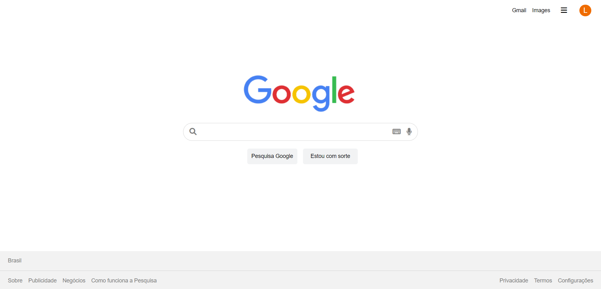

⚠️ EM DESENVOLVIMENTO ⚠️ 

 

 
 

<h1 align="Star">
UI Clone - Google
</h1>

Google Homepage clone for study purposes.  <a href="https://exquisite-gingersnap-073c71.netlify.app/">Deploy</a>

 

## Resources

 

    

 

## Start Dev Environment for VSCode

1. Open project folder in `VSCode`
2. Install `Live Server` extension
3. Right click `index.html` > `Open with Live Server`
4. Access the **generated address** in your browser 🚀
